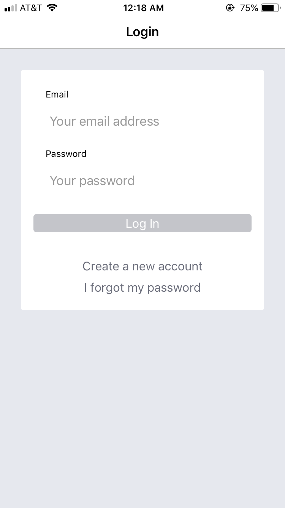
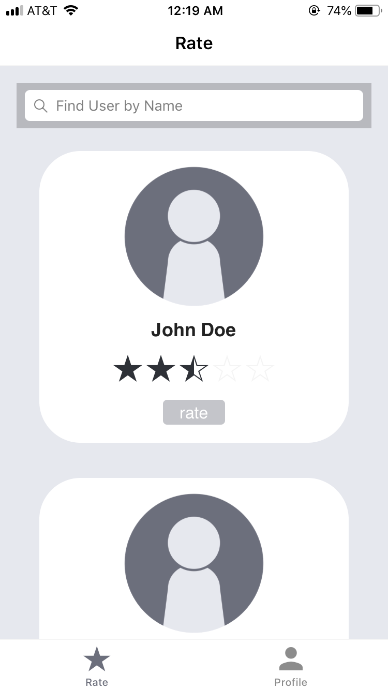
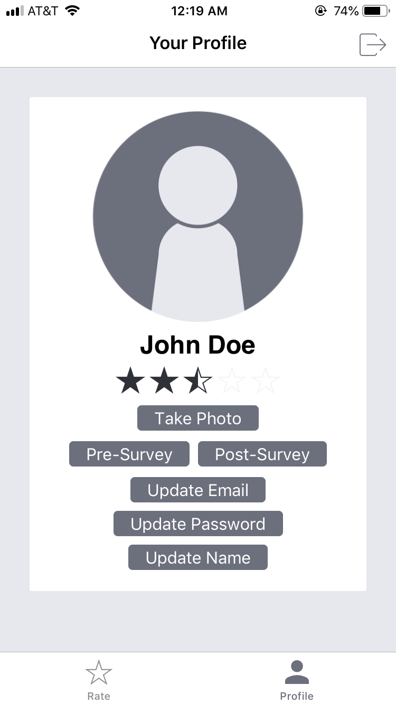
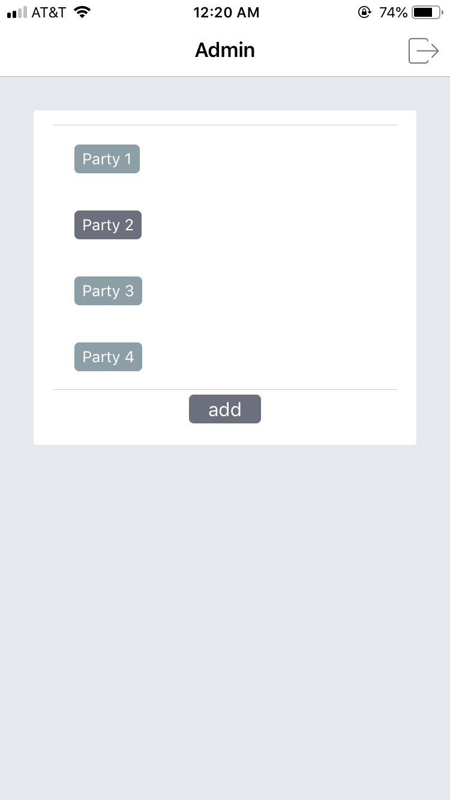

# Nosedive
A cross-platform app for use in research experiments on reputation effects in social interactions.

### Overview of Project
#### Inspiration
Ant Financial implemented the Zhima (Sesame) Credit System in China in 2015, using data from Alibaba’s variety of resources, including purchases and social media connections, to derive a national social credit system. The Chinese government hopes that, as the system expands and gains traction across the country, it will effectively govern the civil behavior of its citizens. The quality of each individual’s credit rating determines their access to bank loans and certain private schools, and can result in discounts or bans from airlines, trains, and hotels. In theory, the significant influence of these social credit ratings should motivate individuals to seek self-improvement through a moral and commendable lifestyle. 

However, the effects of such a system could affect the overall quality of life of its members. As portrayed in a 2016 episode of the Netflix series *Black Mirror* titled "Nosedive," a  social credit rating system can play on modern society’s obsession with social comparisons and reputation to have severe consequences on social relationships. The implications enforce a national culture of judgment with both incentives and consequences that could alter the way people approach social interactions. This dystopian depiction of a hypothetical social credit system acts as the main motivation for a set of experiments on reputation effects in social interactions, and this app, created for use in these experiments, takes inspiration from the social rating app portrayed in the episode. 

#### Purpose
This app will be used in research experiments on reputation effects in social interactions. In each experiment, up to thirty participants will engage in a simulated social gathering. After signing informed consent forms and setting up a device with the app, participants will then mingle throughout the room and rate the other participants after interacting with them. Participants then complete an evaluation survey that asks the participants to rate their experience in terms of multiple social experience factors, including quality, length of conversation, and sincerity.

The app also allows an admin account to change party settings that correlate to different experimental conditions. There are three aspects of the experiment the admin can manipulate through the app: the ability to rate others, the participants' initial ratings, and the weightedness of the averaging equation. In the control trials, users will interact in the social setting without rating the other participants, so the app will block users in this condition from the rating screen. The app can also determine if all users begin at a neutral rating of 2.5 or if they begin evenly distributed between the lowest (1) and the highest (5) rating. Finally, the admin can determine if all new ratings are simply averaged into the user's existing rating or if the rating of the rater weights the average, giving users with higher ratings more influence on the ratings of other users. These conditons are set when the admin adds a new party.

#### Tools
- *Ionic:* This app utilizes the Ionic Framework (v. 4.9.0) for building cross-platform hybrid apps, allowing it to function as both a mobile and web app. This framework is built on Angular and leverages Cordova for mobile device functionality. Full documentation can be found at https://ionicframework.com.
- *Firebase:* The app also uses Googles Firebase for user authentication and data storage. Users can sign up with an email and password, which is stored in Firebase for future authentication. The realtime database then synchronizes application data across iOS, Android, and Web devices, and stores it on Firebase's cloud. This allows user ratings to update in realtime based on interactions users have during the party. Firebase also allows the admin to restrict read and write permissions on the database, so participant data can be safely kept in the Firebase cloud. Full documentation can be found at https://firebase.google.com.


### Features
#### User Functionality
Most users in the app are particpants in the experiment who are able to view other users and rate them on a five-star scale. On the home page of the app, users can see a list of other users with their pictures, name, and current rating and search for other participants by name. They can then click the stars underneath other users and hit save to rate them, but they are restricted to only rating others once within a five-minute timeframe. On the profile page, users can see their own information, edit their email and password, fill out pre- and post-surveys, and log out of the app. 

  

#### Admin Functionality
The admin account, controlled by the CosanLab, can add and set the conditions for new parties. The parties are referred to by number throughout the app, and are automatically numbered in increasing order. When the admin adds a party, they can set three different conditions...
- Rating Other Users: If checked, users will not be able to rate other users and will only be able to access the profile         page of the app
- Varied Start: If checked, users will begin the party with equally distributed ratings between 1 and 5. If not checked, all users will begin the party with a neutral rating of 2.5
- Weighted Ratings: If checked, a user with a high rating will affect the ratings of other users more than a user with a low rating. A user's rating of another user is "weighted" by their own rating. If not checked, all ratings are equally averaged into the user's current rating regardless of who does the rating.

The admin also uses this page to set the "active" party, which is the party under which new users are registered. Before each experimental trial, the admin should log into the app and set the party with the target experimental conditions as active. This also naturally groups participant information by the trial that they attended.  



### File Structure
The source code for the app is organized as follows...
```
src
--- app
    --- code for initializing and rendering all components of the app
    --- imports necessary native plugins, providers, etc.
    --- contains environment.ts that connects app to Firebase database
--- assets
    --- icons and images used by the app
--- components
    --- code for star rating element for use on multiple app pages
--- pages
    --- subfolder for all pages of the app
    --- includes their html and typescript 
    --- eleven total pages 
        --- about, admin, home, login, no-ratings, pre-survey, 
            post-survey, post-survey-2, reset-password, signup, tabs
--- providers
    --- functionality used by multiple pages throughout the app
    --- mostly act as bridges betweent the app and firebase
    --- three providers
        --- auth, profile, party
--- theme
    --- css for theming the entire app
--- validators
    --- code to make sure entered email is in proper format
```

### Authentication and Database Services
Google Firebase is used for both user authentication and data storage. 
- *Authentication:* Users can sign up for the app with an email and password, but do not have to confirm their email. The email is only used if the user needs to reset their password. This information is stored in Firebase's authentication service with a unique user ID, then the ID and email are copied into the database. From the Authentication tab on Firebase, CosanLab can also reset passwords and disable or delete accounts. In the future, other ways of authenticating accounts (Facebook, Google, etc.) could be added, but since users aren't expected to return to the app after the experiment the only method currently available is email.
- *Data Storage:* User data is stored under the party that was active when they registered. For each user, the app stores the information they used to sign up for the app along with their photo and survey responses. Each party subdirectory also houses four booleans that indicate if the party is active and which experimental conditions hold for that party. The lists of user profiles under each party are also initialized with the admin account. For a full breakdown of the database structure and for privacy information, see [DATABASE.md](https://github.com/emmalangfitt/Nosedive/blob/master/DATABASE.md).

### Hosting the App
The app will be hosted as a web app at `https://labapp-55218.firebaseapp.com` for testing. A mobile version will also be available for download through Apple's TestFlight for iOS devices and Google Play for Android devices. 

### Context
This app was created for a thesis experiment conducted by Tucker Brown (Dartmouth '19) with support from Dartmouth's Computational Social Affective Neuroscience Laboratory, directed by Luke Chang.
